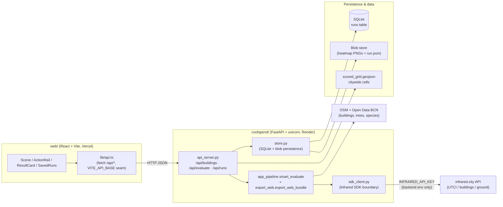
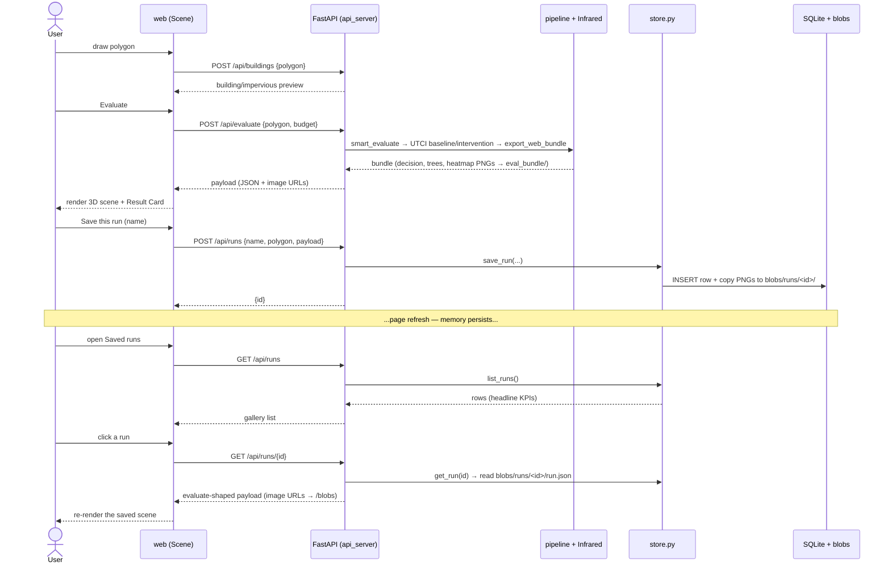
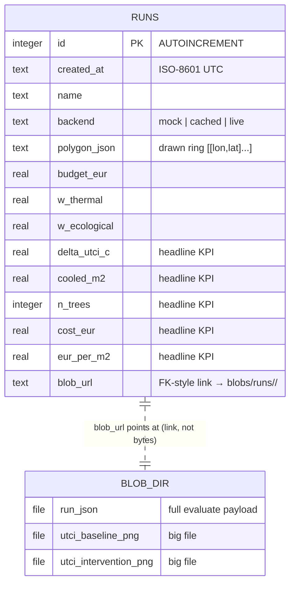
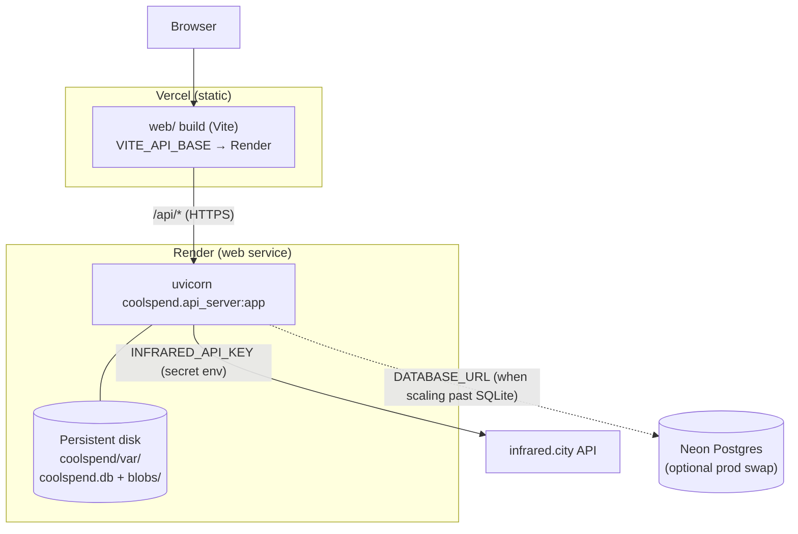

# CoolSpend — Architecture

> "Read the machine." Four diagrams answer four questions about how CoolSpend
> actually runs — the [IAAC Day-2](https://slides.infrared.city/iaac-day2/)
> toolkit applied to this repo. Each Mermaid block renders on GitHub.

CoolSpend is a two-part app:

- **`web/`** — a React + Vite + deck.gl/Mapbox/Cesium frontend (draw a block in
  Barcelona, see the cooling).
- **`coolspend/`** — a FastAPI backend that runs the real placement + Infrared
  UTCI pipeline and now **remembers** evaluated runs (SQLite + a blob store).

---

## 1 · Component — what are the parts?

The Infrared key lives **only** in the backend process (env var). The browser
never sees it — see [§ Exercise B](#exercise-b--the-key-stays-on-the-backend).

---

## 2 · Sequence — what happens, in what order?

The draw → evaluate → **save → reload** loop. Save/reload is the new "memory".

---

## 3 · Entity-Relationship — what data, and how is it related?

One table. The slides' Exercise-A split: **queryable metadata in columns**, the
**heavy heatmap files in the blob store**, and the row holds **only a link** to
them (`blob_url`) — never the bytes.

Exactly how Infrared itself works: a database for metadata, object/blob storage
for the heavy rasters. Swap seams (no caller changes): `DATABASE_URL` →
Postgres/Neon, `BLOB_DIR`/`BLOB_BASE_URL` → S3/R2.

---

## 4 · Deployment — where does each part run?

SQLite on the Render disk is the MVP. **Caveat:** a free-tier redeploy can reset
that disk — for durable storage point `DATABASE_URL` at Neon and the blob store
at S3/R2. See [`DEPLOY.md`](./DEPLOY.md).

---

## Exercise B — the key stays on the backend

The slides' leak exercise (`const KEY = "sk-infrared-…"` in frontend code) — **this
repo never had it.** `INFRARED_API_KEY` is read by the SDK from the backend
environment only; it is never accepted over HTTP, never logged, never returned
(`coolspend/api_server.py` header; `coolspend/sdk_client.py:_live_utci` key
check). The browser calls **our** backend; the backend calls Infrared. The
`VITE_API_BASE` env var in the frontend is only a public backend URL — not a
secret.

## Registry pattern — noted, not built

The slides suggest a registry so "add a simulation = one file + one line."
CoolSpend runs a single sim family (Infrared UTCI / TCS), so a multi-sim registry
would be speculative abstraction today. The seam to add: a `metric -> runner` map
in `sdk_client.py` if/when a second metric (e.g. wind/PWC) is wired.
