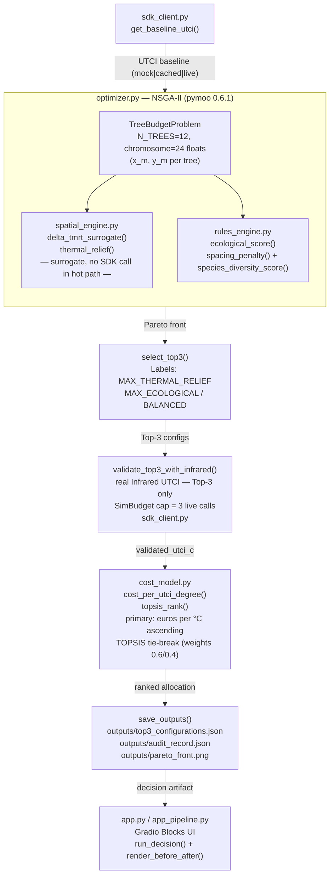

## CoolSpend — Tree Budget Optimizer

CoolSpend is a heat-mitigation budget decision-support tool built for the infrared.city SDK Buildathon (Tree Budget track). A city Chief Heat Officer provides a site polygon and a fixed planting budget. CoolSpend runs a baseline UTCI thermal-comfort simulation, identifies the hottest, most sun-exposed street locations, and uses a multi-objective NSGA-II optimizer to propose where to plant trees so that each euro buys the most degrees of street-level comfort relief. The result is a ranked budget allocation and a before/after UTCI map — a defensible decision, not just a heatmap.

The app defaults to Plaça dels Àngels, Barcelona. Switch the polygon text box to any GeoJSON site to run a new optimization.

## Run locally (offline, no API key)

Install dependencies:

```
pip install -r requirements.txt
```

Launch the Gradio UI in mock mode (no key required):

```
python -m coolspend.app
```

Headless smoke test (no browser, no server):

```
python -c "import coolspend.app as a; a.build_demo()"
```

Full test suite (offline):

```
python -m pytest coolspend/tests/ -q
```

## Deploy to Hugging Face Spaces

This is the user's final step (Infrared API key issued at hackathon kickoff May 27).

1. Go to huggingface.co → New → Space → SDK: Gradio → give it a name.
2. Push this repo to the Space (or connect the GitHub repo via Settings → Repository).
   The `README.md` YAML header above makes Hugging Face recognise it as a Gradio Space and
   sets `app_file: coolspend/app.py` as the entry point.
3. Hugging Face automatically installs `requirements.txt` on each build — no extra config needed.
4. The Space starts in mock mode by default (no key required for the public demo).

## Live Infrared backend (real UTCI)

To switch from mock data to real Infrared SDK calls, add two Space Secrets in
Space → Settings → Variables and secrets:

- `INFRARED_BACKEND=live`
- `INFRARED_API_KEY=<your key from the infrared.city hackathon dashboard>`

With these set the app calls the Infrared UTCI API to re-simulate the Top-3 configurations
and shows the real measured UTCI deltas in the call-log panel. **Never commit the key to the
repository.**

**Live wiring status:** the SDK boundary is implemented and the live path wires polygon
coordinates through to InfraredClient.run_area_and_wait. The exact AnalysesName member and
merged_grid field name require confirmation against the installed infrared-sdk version on
May 27 (see MOCKS.md live row and sdk_client.py TODO). The live path has not yet been
confirmed end-to-end against the real API in this repository.

mock = NOT MEASURED DATA (surrogate values, synthetic, for integration only)
live = real Infrared UTCI API calls (wired; unverified until May 27 key confirmation)

**Known limitation — live call count (Security M1):** one "Run" with
`INFRARED_BACKEND=live` makes 4 live Infrared SDK calls (1 baseline + 3 Top-3
interventions). On a public Hugging Face Space this can be abused. Recommendations:
guard the live backend behind an additional server-side environment flag (e.g.
`LIVE_BACKEND_ENABLED=1`) checked in `app_pipeline.run_decision` before flipping
`INFRARED_BACKEND`, and add a per-IP or per-session rate limit at the Space level.
The current implementation does not enforce either — treat this as a pre-production
limitation before opening the Space to the public.

## Out-of-Scope / Not Modeled

This tool provides **geometric feasibility, not engineering siting sign-off.** The following factors are explicitly not modeled:

- **Subsurface utilities** — underground pipes, cables, and conduits
- **Soil volume** — rooting volume constraints and subgrade conditions
- **Irrigation / water demand** — tree water requirements and irrigation infrastructure
- **Sightlines** — visual obstruction and traffic sight-distance impacts
- **Solar access to buildings** — winter shading of facades or photovoltaic panels
- **Root-vs-pavement conflict** — long-term root uplift and pavement damage potential

All proposed placements must be reviewed by municipal engineering, arboriculture, and infrastructure teams before implementation.

## Honesty / MOCKS note

The thermal surrogate (`delta_tmrt_surrogate`) carries approximately +/-4 degC uncertainty
and the 12 degC cap (`MAX_TMRT_REDUCTION_C`) is unsourced (no validated citation).
Full details, data-source tags, and the complete MOCKS ledger are documented in
[MOCKS.md](MOCKS.md) (Phase 4 / SHIP-02). Do not interpret mock results as
measured data.

## Architecture



Six modules: `sdk_client`, `spatial_engine`, `rules_engine`, `cost_model`, `optimizer`, `app`.
The NSGA-II hot path calls only the analytical surrogate — zero SDK calls during optimization.
When `INFRARED_BACKEND=live`, the SDK is called exactly three times (Top-3 validation,
SimBudget-guarded). The live wiring is implemented; see MOCKS.md for current verification status.

## How it works

CoolSpend takes a site polygon and a planting budget, then runs a three-stage pipeline.
First, it fetches a baseline UTCI thermal-comfort score for the open site via `sdk_client`
(mock by default; real Infrared SDK when `INFRARED_BACKEND=live`).
Second, an NSGA-II multi-objective optimizer (`pymoo 0.6.1`) searches over 12-tree
planting configurations — each chromosome encodes 24 floats (x_m, y_m per tree slot) —
maximising two objectives simultaneously: thermal relief (via an analytical surrogate of
delta mean-radiant-temperature, `delta_tmrt_surrogate`, with ±4 degC uncertainty) and
ecological coherence (spacing + species diversity from `rules_engine`).
The analytical surrogate runs with zero SDK calls, keeping the hot path fast.
Third, the Top-3 Pareto candidates are re-simulated with Infrared UTCI (SimBudget
cap = 3) when run live, replacing surrogate values with real measured UTCI deltas.
Rankings use the headline KPI — euros per degree Celsius of UTCI relief
(`cost_per_utci_degree`) — and are emitted as a ranked decision artifact.

**Honesty contract:** all mock numbers are NOT MEASURED DATA; the €/°C cost constants
(CAPEX_PER_TREE_EUR=350, OPEX_PER_TREE_YEAR_EUR=35) are DECLARED assumptions that
REQUIRE_VERIFICATION against municipal procurement data.
The 12 degC surrogate cap (`MAX_TMRT_REDUCTION_C`) is unsourced; see [MOCKS.md](MOCKS.md).

## Project structure

```
coolspend/
  sdk_client.py       — UTCIResult, SimBudget; mock|cached|live UTCI dispatch
  spatial_engine.py   — site loader (GeoJSON), collision gate, delta_tmrt_surrogate (analytical proxy)
  rules_engine.py     — spacing_penalty, species_diversity_score, ecological_score
  cost_model.py       — per_tree_cost, total_cost, cost_per_utci_degree (euros/degC KPI)
  optimizer.py        — TreeBudgetProblem (NSGA-II), select_top3, validate_top3_with_infrared,
                        topsis_rank, save_outputs, write_audit_record, plot_pareto
  app.py              — Gradio Blocks UI entry point (build_demo)
  app_pipeline.py     — run_decision() — orchestrates baseline → optimize → validate → rank
  app_viz.py          — render_before_after() — before/after UTCI map panel
  main.py             — CLI entry point (python -m coolspend.main)
  data/
    angels_site.geojson  — hand-authored site fixture (MOCK — see MOCKS.md)
  cache/              — disk cache for INFRARED_BACKEND=cached replay
  tests/              — full pytest suite (offline, deterministic)
outputs/              — top3_configurations.json, audit_record.json, pareto_front.png
MOCKS.md              — honesty ledger: every mock/surrogate/DECLARED constant
```
